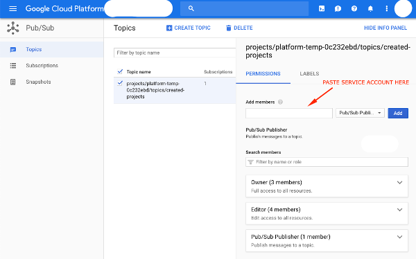

# GCP API Enabler

Google Cloud Function that enables stated APIs for newly created projects. GCP API Enabler saves your time, especially when you need to create multiple GCP projects at once.

[](http://www.serverless.com) 
[](https://python.org) 
[](https://github.com/ambv/black) 
[](https://github.com/kiwicom/gitlab-unfurly/blob/master/LICENSE)

GCP API Enabler has two handler methods - one that gets triggered with simple GET request, and another one that can be triggered from Google Cloud Pub/Sub topic when new project in organization is created. In the documentation below, we will show you how to setup a function that will be triggered when a new project is created under your Google Cloud organization.

The one that gets triggered with GET request will enable stated APIs for all your organization project, and because of that it can take a while.

The other one, triggered by the Pub/Sub topic when new project is created, will enable APIs only for that project.

## Usage

### Requirements

If you do not have it already, install [gcloud SDK](https://cloud.google.com/sdk/install).

```bash
git clone git@github.com:kiwicom/gcp-api-enabler.git
cd gcp-api-enabler
pip install -r requirements.txt
npm install
```

### Google Cloud Platform

You will deploy GCP API Enabler to [Google Cloud Platform](https://cloud.google.com/) using [Serverless](https://serverless.com/) framework. But first, make sure you configure everything mentioned below. Most of the actions can be fulfilled using gcloud SDK, but for some, you will need to handle it manually.

#### Billing Account

If you have access to your organization and you do not have Billing Account yet, you will need to create a new [Billing Account](https://serverless.com/framework/docs/providers/google/guide/credentials#create-a-google-cloud-billing-account) first. Otherwise, skip this step.

#### GCP project

If you do not have an existing GCP project where you will setup API enabler, you will need to create a new one, either manually or with [gcloud SDK](https://serverless.com/framework/docs/providers/google/guide/credentials#create-a-new-google-cloud-project).

```bash
gcloud projects create your-project-id --name="Your project name"
```

Otherwise, skip this step.

#### Enable necessary APIs

In order for Serverless framework to work, you will need to enable this [necessary APIs](https://serverless.com/framework/docs/providers/google/guide/credentials#enable-the-necessary-apis).

Additionally, in order for this Cloud Function to work, enable this necessary APIs:
* [Cloud Resource Manager API](https://console.cloud.google.com/apis/library/cloudresourcemanager.googleapis.com)
* [Service Usage API](https://console.cloud.google.com/apis/library/serviceusage.googleapis.com)

```bash
gcloud services enable cloudfunctions.googleapis.com
gcloud services enable deploymentmanager.googleapis.com
gcloud services enable storage-component.googleapis.com
gcloud services enable logging.googleapis.com
gcloud services enable cloudresourcemanager.googleapis.com
gcloud services enable serviceusage.googleapis.com
```

#### Get deployment credentials & assign roles

In order to create a new service account that you will use to deploy API Enabler, follow [Serverless documentation](https://serverless.com/framework/docs/providers/google/guide/credentials#get-credentials--assign-roles).

If you already have sufficient service account, skip this step.

#### Assign roles to service account used by cloud functions

At runtime, Cloud Functions defaults to using the service account PROJECT_ID@appspot.gserviceaccount.com, which has the Editor role on the project.

Since API Enabler needs to access all the projects under the organization, be sure you grant `editor` role to this service account (PROJECT_ID@appspot.gserviceaccount.com) on the organization level. This is needed because API Enabler needs to get the list of services in other projects and needs to have permissions to enable them.

#### Topic setup

1. Create Pub/Sub topic

```bash
gcloud pubsub topics create topic-name
```

2. Create aggregated export within your organization

```bash
gcloud logging sinks create sink-name  \
pubsub.googleapis.com/projects/your-project-id/topics/topic-name --include-children \
--organization=YOUR_ORGANIZATION_ID --log-filter="resource.type=project AND protoPayload.methodName=CreateProject"
```

Output of this method will be something like:

`Please remember to grant 'serviceAccount:o123456789012-123456@gcp-sa-logging.iam.gserviceaccount.com' Pub/Sub Publisher role to the topic.`

3. Manually add service account from Step 2 as a publisher role to the Pub/Sub topic created in Step 1.



4. Try to [test your topic](https://cloud.google.com/pubsub/docs/quickstart-console) to see if it works correctly.

### Deployment

#### Adjust custom settings

```bash
cp .custom.yml.example .custom.yml
```

In `.custom.yml`, adjust `PROJECT_ID`, `GCLOUD_CREDENTIALS` and `TOPIC_NAME`.

`PROJECT_ID` - your (new) project id
`GCLOUD_CREDENTIALS` - path to gcloud credentials downloaded above
`TOPIC_NAME` - Pub/Sub topic name you created above

#### Change services

If you want to change a list of services that you would like to enable, change this list in `init_services` and redeploy.

```python
def init_services():
    return {
        'container.googleapis.com': True,
        'compute.googleapis.com': True,
        'storage-api.googleapis.com': True,
        'cloudresourcemanager.googleapis.com': True
    }
```

True/False states whether API should be enabled or disabled (but it won't

#### Deploy

```bash
serverless deploy -v
```

## Contributing

Bug reports and fixes are always welcome!

Tests are run with [pytest](https://pytest.org). Install into virtual environment 
`requirements.txt` and `test-requirements.txt` and run in shell command `pytest`

Code is formatted by [Black](https://github.com/ambv/black).

## License

[MIT](https://github.com/kiwicom/gitlab-unfurly/blob/master/LICENSE)
